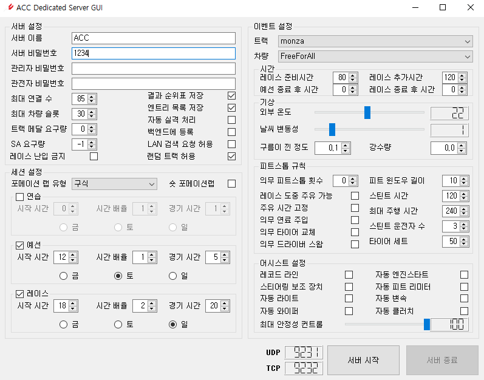
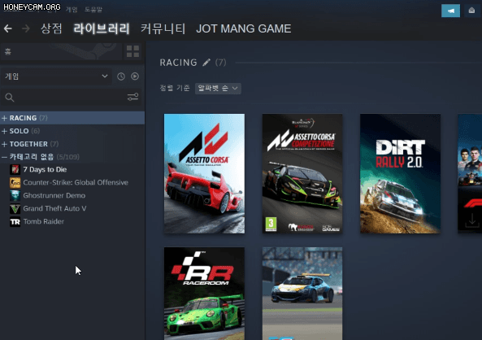
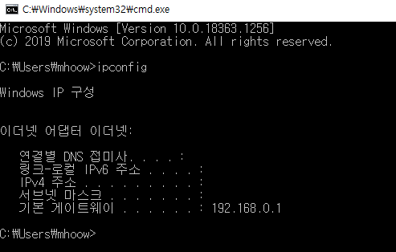
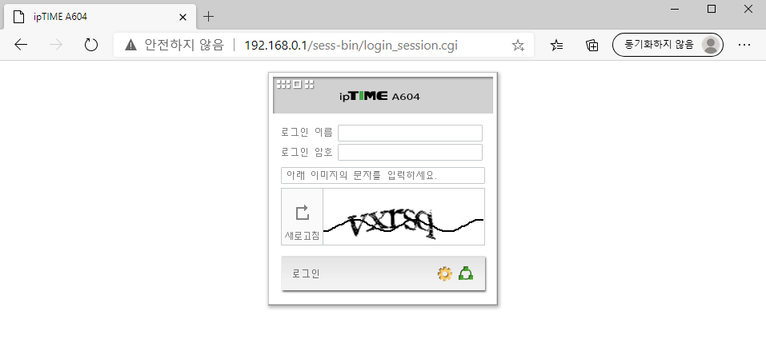
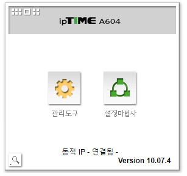
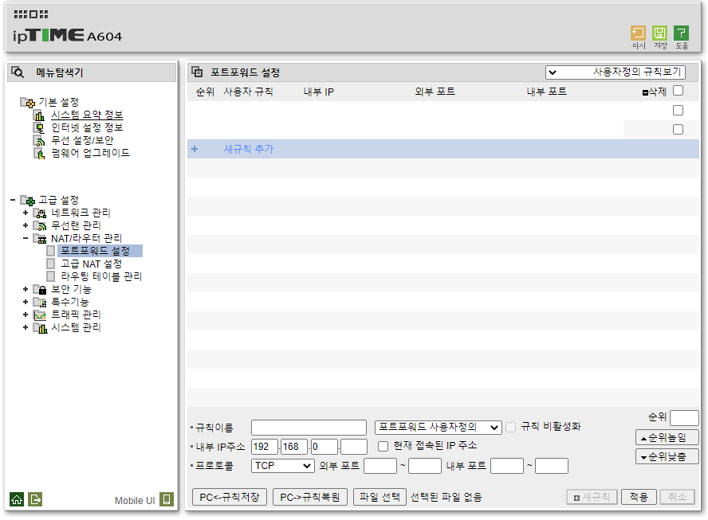
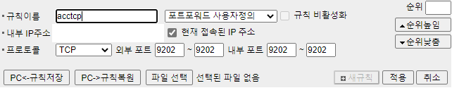

# Assetto Corsa Competizione Dedicated Server Graphic User Interface

이 프로그램은 pyQt5를 이용해서 개발한 GUI(Graphic User Interface)입니다.
서버 생성에 필요한 각종 json 파일을 불러와 수정하고, 서버를 생성시킬 수 있습니다.
아쉽게도, 서버를 생성하는 기능은 Steam의 Assetto Corsa Competizione Dedicated Server의 accServer.exe를 이용하므로 **반드시 프로그램이 accServer.exe와 같은 경로에 있어야 원활하게 사용이 가능합니다.**

---
## 선행 작업
프로그램을 이용하기 전, 다음과 같은 사전 작업이 필요합니다.

---

### 1. Assetto Corsa Competizione Dedicated Server 설치

1. 스팀 실행 후 라이브러리에 들어가기
2. 카테고리 옵션을 게임 및 도구로 변경
3. Assetto Corsa Competizione Dedicated Server 설치

---

### 2. 포트포워딩

기본 게이트웨이 주소를 웹 브라우저의 주소 표시줄에 입력하고, 웹 관리 인터페이스에 접속하여 UDP와 TCP를 configuration.json 파일에 있는 값에 맞게 포트포워딩해야 합니다.

### 2-1-1 IP 주소 확인법

1. 윈도우 + R 입력하여 실행 창 생성 후 cmd 입력
2. cmd 창에서 ipconfig 입력
3. IPv4 주소 확인
4. 기본 게이트웨이 주소(웹 관리 인터페이스에 접속할 주소) 확인

### 2-1-2. 웹 관리 인터페이스 접속

다음과 같은 화면이 출력된다면, 최초 공유기 설정 때 정했던 관리자 아이디와 암호를 입력하여 로그인합니다. 만약 아이디와 암호가 기억나지 않는다면 https://blog.naver.com/meyouhappy/221576825822 을 확인하세요.

### 2-1-3 로그인 후 화면

로그인에 성공하시면 관리도구를 클릭하여 관리 패널에 접속해주세요.

### 2-1-4 관리 패널

고급 설정 - NAT/라우터 관리 - 포트포워드 설정에 들어가시면 다음과 같은 화면이 나옵니다.

### 2-1-5 포트포워딩

규칙이름은 아무거나 입력하셔도 됩니다. 내부 IP주소는 [2-1-1](#2-1-1-ip-주소-확인법) 에서 확인했던 IPv4주소를 입력해주시고, 프로토콜과 외부 포트, 내부포트는 configuration.json의 값에 맞게 입력하시면 됩니다. [처음에 보여줬던 프로그램 메인 화면을 예시](#assetto-corsa-competizione-dedicated-server-graphic-user-interface)로 들면 TCP 값이 9232이므로 외부포트와 내부포트를 모두 9232로 입력하시면 됩니다. UDP또한 관리 패널에서 프로토콜을 TCP에서 UDP로 변경하시고 똑같이 작업하시면 포트포워딩 작업이 끝납니다.

---

## 프로그램 사용법